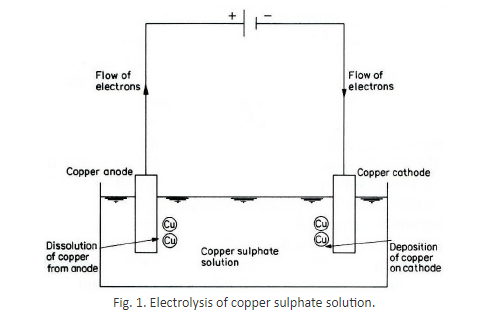
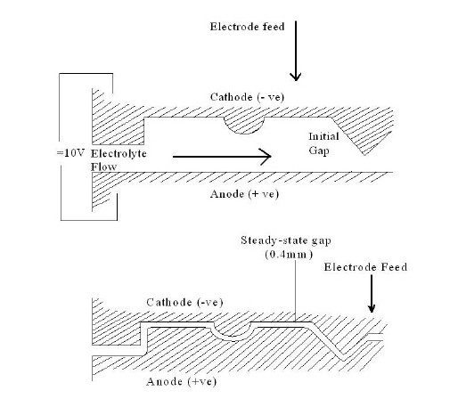
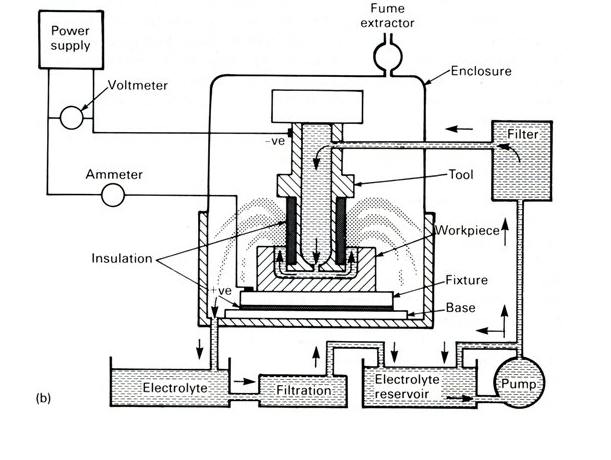

### Prerequisite

The user is required to have knowledge of few important concepts in order to understand the experiment.

1.   Electrolysis process
2.   Faraday's laws of electrolysis
3.   Ohm's law and related concepts

### Theory
**1. Electrolysis**

Electrolysis is a chemical process, which occurs when an electric current is passed between two conductors (electrodes having different potentials) dipped into a liquid solution (electrolyte). The conductor connected to positive terminal is referred as anode and another connected to negative terminal is called as cathode. The system of electrodes and electrolyte is referred as electrolytic cell, whilst the chemical reactions, which occur at the electrodes, are called as the anodic or cathodic reactions.

Electrolytes are different than metallic conductors of electricity, in that the current is carried not by electrons but by atoms (ions) or group of atoms.

**For Example:** Electrolysis of an Aqueous Copper Sulphate Solution using Copper Electrodes. The electrolysis of an aqueous solution of copper sulphate using copper electrodes (i.e. using active electrodes) results in transfer of copper metal from the anode to the cathode during electrolysis. The copper sulphate is ionized in aqueous solution.

CuSO4 ==> Cu (++) + SO4 (-.-)              ........................(1)

The positively charged copper ions migrate to the cathode, where each gains two electrons to become copper atoms that are deposited on the cathode.

Cu (++) + 2e (-) ==> Cu              ...........................(2)

At the anode, each copper atom loses two electrons to become copper ions, which go into solution.

Cu ==> Cu (++) + 2e (-)              ...........................(3)

The sulphate ion does not take part in the reaction and the concentration of the copper sulphate in solution does not change. The reaction is completed when the anode is completely eaten away. This process is used in electroplating. Therefore in the electrolysis of copper sulphate, when the electrodes are weighted at the end of electrolysis, the anodic electrode will be found to have lost weight, whilst the cathodic electrode gains the weight by an amount equal to the lost by other electrode.

**Faraday's laws of electrolysis:**

The results of electrolysis are embodied in Faraday's two laws of electrolysis as below
1. The amount of any substance dissolved or deposited is directly proportional to the amount of electricity which has flowed; and
2. The amounts of different substances deposited or dissolved by the same quantity of electricity are proportional to their chemical equivalent weights.

The two laws may be combined to give the equation

m= AIt/zF              ----------- (1)

where m = the mass dissolved from or deposited upon
            I = current
           t = time
           A = atomic weight
           z = valency, A/z is the chemical equivalent
           F = Faraday's constant, it is the amount of electric charge necessary to liberate one gram equivalent (A/z) of an ion in electrolysis and is equal to 96500 C.

**Development of characteristics of ECM:**

The means by which high current densities are obtained can be understood from an examination of other characteristics of an ECM cell in particular, the electrolyte conductivity and inter-electrode gap width. These parameters are related to the current through Ohm's law, which states that the current I flowing in a conductor is directly proportional to the applied voltage V.

V= IR       ----------(2)

R is the resistance of the conductor.
In electrolysis process, electrolytes are conductors of electricity. Ohm's law also applies to this type of conductor, although the resistance of electrolytes may amount to hundreds of ohms.
Now, the resistance R of a uniform conductor is directly proportional to its length h, and inversely proportional to its cross sectional area A. Thus

R= h&rho;/A       ---------- (3)

Where ρ is the constant of proportionality. If the conductor is a cube of side 10 mm, then R = &rho; ; &rho; is termed as specific resistivity of the conductor. The reciprocal of specific resistivity is known as specific conductivity. Combining equations 2 and 3 the relationship are derived between the average current density, current, surface area to be machined, applied potential difference, gap width, and electrolyte conductivity being denoted by the respective symbols J, I, A, V, h, and ke

J= I/A = ke V/ h

In actual practice the voltage values ranges from 10 to 20 V. and for this the gap width is about 0.4 mm and feed rate about 0.02 mm/sec is needed.

**Working principle of Electrochemical Machining (Theory):**

Electrochemical machining is based on the principle of outlined in Fig. 2, the workpiece and tool are the anode and cathode respectively, of the electrolytic cell, and a potential difference, usually at about 10 V, is applied across them. A suitable electrolyte, for example aqueous sodium chloride solution is chosen so that the cathode shape remains unchanged during electrolysis. The electrolyte is pumped at a rate 3 to 30 m/sec through the gap between electrodes to remove the products of machining and to diminish unwanted effects, such as those that arise with cathodic gas generation and electric heating. The rate at which metal is then removed from the anode is approximately in inverse proportion to the distance between the electrodes. As machining proceeds, and with the simultaneous movement of the cathode at a typical rate, for example, 0.02 mm/sec towards the anode, the gap width along the electrode length will gradually tend to a steady-state value. Under these conditions, a shape, roughly complementary to that of cathode, will be produced on the anode. A typical gap width then should be about 0.4 mm.

**Experimental set up:**

The schematic of an industrial electrochemical machine is as shown in Fig. 3.

The number of process variables affects on the results of the ECM process. The most important of these being

1. tool feed rate
2. current density
3. electrolyte-type, composition, temperature, flow rate
4. tool and fixture-material, construction and finish
5. work piece material condition
6. cutting gap

**Advantages of ECM Process:**

1. the rate of metal removal does not depend on the hardness of the material
2. complicated shapes can be machined on hard metals and
3. there is no tool wear.